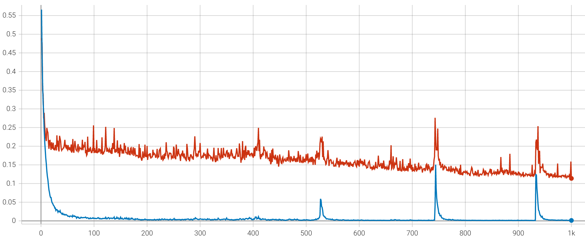

# NiN训练中的问题
## 模型train_loss和val_loss保持在0.69，参数不训练 【已解决】

* 调节学习率 --> 无效
* 取消数据增强 --> 无效
* 更换参数初始化方法 --> 无效
* 更换优化器 --> 无效
* 加入Dropout --> 无效

查看网络输出 --> 输出趋于零，且十分不稳定

---
仅在Inception中第一个卷积层后加入BatchNormalization，模型开始训练，收敛于val_loss=0.38附近。

在Inception所有卷积层后加入BatchNormalization，模型开始训练，收敛于val_loss=0.20附近。

## 训练过程中loss会偶然突然增加后减小 【未解决】
* 尝试降低学习率 3e-2降至3e-3 --> 无效

